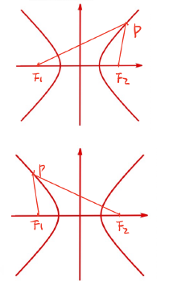
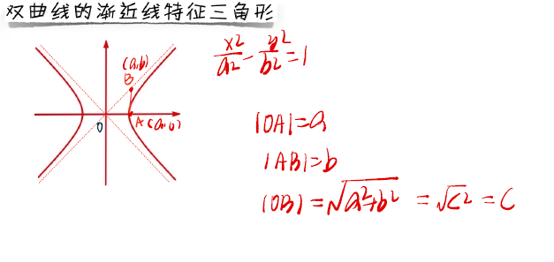

### [*点击回到目录*](./目录.md) 
## 双曲线
- ### 双曲线的定义

#### ***定义 :***

 **到两点(焦点)距离之差(写作2a)为定值,且2a<2c的点的集合**   
 **如图 :**   
 - 右支:$|PF_1|-|PF_2|=|F_1F_2|$ 
 - 左支:$|PF_2|-|PF_1|=|F_1F_2|$ 
 - 总写:$^|_||PF_1|-|PF_2|^|_|=|F_1F_2|$ 
    
      
- ### 双曲线的公式

#### ***公式 :*** 

$$
\frac{x^2}{a^2}-\frac{y^2}{b^2}=1
$$

其中,$c^2=a^2+b^2$

#### ***公式推导 :***    [类比椭圆](./椭圆.md/#公式推导)    

- ### 双曲线的渐近线

#### ***渐近线的计算方法:***    
① $\frac{x^2}{3}-\frac{y^2}{4}=1$

② $\frac{y^2}{4}-\frac{x^2}{3}=1$   

③ $\frac{x^2}{3}-\frac{y^2}{4}=5$

**以上三种①:焦点在x的标准方程,②:焦点在y的标准方程,③:不标准方程.**   
求渐近线的方法都是:**将右侧数字改为"0"**

- ### 常见模型与解题方法:

#### ***双曲特征三角形 :*** **体现出了abc三个参数.**
  
