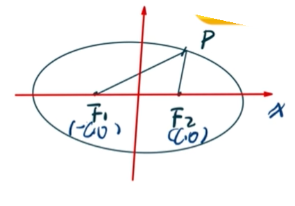

### [*点击回到目录*](./目录.md) 
## 椭圆
- ### 椭圆的定义
    
***定义:***    **到两点[^1]\(焦点)距离之和[^2]\(长轴长,写作2a)相等的,且距离之和大于两点直线距离[^3]\(焦距,写作2c)的点的集合.** 
[^1]:这两点称作椭圆的焦点.
[^2]:P到两点的距离之和称作长轴长,写作2a.
[^3]:两点的直线距离称作椭圆的焦距,写作2c.
[^4]:椭圆上任意一点用p表示

**如图[^4]:|PF1|+|PF2|=2a,其中2a > 2c (|F1F2|)**    
    
     
- ### 椭圆的公式: 
***公式 :***
$
{x^2\over a^2}+{y^2\over b^2}=1
$
***公式推导 :***    
①两点距离公式 :    
$ \sqrt[2]{(x_1-x_2)^2+(y_1-y_2)^2}$    

②椭圆定义:椭圆上一点,到两焦点的和为定值.     
**结合①②列式化简即得椭圆公式.**
- ### 常见模型与解题方法:
***通径 :***
垂直于焦点的线段(用t表示)
$
t = 2|PF|=2 \cdot \frac{b^2}{a}
$
